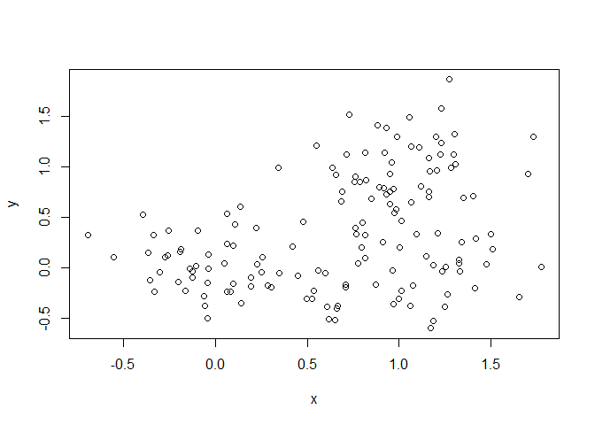

Class 08
================
Diego Quintero
10/25/18

K-means clustering
------------------

Our first example with **kmeans()** function.

``` r
#Example plot to see how Rmarkdown works
plot(1:10, typ="l")
```

 Back to kmeans...

``` r
# Generate some example data for clustering
tmp <- c(rnorm(30,-3), rnorm(30,3))
x <- cbind(x=tmp, y=rev(tmp))
plot(x)
```


``` r
k <- kmeans(x, centers=2, nstart=20)
```

Use the kmeans() function setting k to 2 and nstart=20 Inspect/print the results Q. How many points are in each cluster?

``` r
print(k$size)
```

    ## [1] 30 30

Q. What ‘component’ of your result object details - cluster size? `k$size` - cluster assignment/membership? `k$cluster` - cluster center?

``` r
table(k$cluster)
```

    ## 
    ##  1  2 
    ## 30 30

``` r
k$centers
```

    ##           x         y
    ## 1 -3.075362  2.954559
    ## 2  2.954559 -3.075362

Plot x colored by the kmeans cluster assignment and add cluster centers as blue points

``` r
palette(c("blue", "red"))
plot(x, col=k$cluster)
points(k$centers, col="blue", pch=20, cex=3)
```


Q. Repeat for k=3, which has the lower tot.withinss?

``` r
k2 <- kmeans(x, centers = 2, nstart= 20)
k3 <- kmeans(x, centers = 3, nstart= 20)
k4 <- kmeans(x, centers = 4, nstart= 20)
k5 <- kmeans(x, centers = 5, nstart= 20)
k2$tot.withinss
```

    ## [1] 158.9227

``` r
k3$tot.withinss
```

    ## [1] 121.6363

``` r
k4$tot.withinss
```

    ## [1] 84.34997

``` r
k5$tot.withinss
```

    ## [1] 69.18963

``` r
plot(c(k2$tot.withinss, k3$tot.withinss, k4$tot.withinss, k5$tot.withinss))
```


Hierarchical clustering in R
============================

Let's try out the **hclust()** funciton for Hierarchical clustering in R. This function needs a distance matrix as input!

``` r
d <- dist(x)
hc <- hclust(d)
plot(hc)
#Drae a line on the dendogram
abline(h=6, col="red")
```


``` r
#Cute the tree to yield membership vector at height 
cutree(hc, h=6)
```

    ##  [1] 1 1 1 1 1 1 2 1 1 2 1 1 1 1 2 1 1 1 2 1 1 2 2 1 1 1 1 1 2 1 3 4 3 3 3
    ## [36] 3 3 4 4 3 3 4 3 3 3 4 3 3 3 3 4 3 3 4 3 3 3 3 3 3

``` r
#Cut the tree to yield membership vector by number of groups
cutree(hc, k=2)
```

    ##  [1] 1 1 1 1 1 1 1 1 1 1 1 1 1 1 1 1 1 1 1 1 1 1 1 1 1 1 1 1 1 1 2 2 2 2 2
    ## [36] 2 2 2 2 2 2 2 2 2 2 2 2 2 2 2 2 2 2 2 2 2 2 2 2 2

### A more 'real' example of data clustering

``` r
# Step 1. Generate some example data for clustering
x <- rbind(
 matrix(rnorm(100, mean=0, sd = 0.3), ncol = 2), # c1
 matrix(rnorm(100, mean = 1, sd = 0.3), ncol = 2), # c2
 matrix(c(rnorm(50, mean = 1, sd = 0.3), # c3
 rnorm(50, mean = 0, sd = 0.3)), ncol = 2))
colnames(x) <- c("x", "y")
# Step 2. Plot the data without clustering
plot(x)
```



``` r
# Step 3. Generate colors for known clusters
# (just so we can compare to hclust results)
col <- as.factor( rep(c("c1","c2","c3"), each=50) )

palette(c("green", "blue","red"))
plot(x, col=col, pch=20)
```


Q. Use the dist(), hclust(), plot() and cutree()
================================================

functions to return 2 and 3 clusters
====================================

``` r
dist_matrix <- dist(x)

hc2 <- hclust(dist_matrix)

#plot(hc2)

#Cutting tree into 2 clusters
by_2 <- cutree(hc2, k=2)


#Cutting tree into 3 clusters
by_3 <- cutree(hc2, k=3)

plot(x,col=by_3, pch=20)
```


Q. How does this compare to your known 'col' groups?
====================================================

``` r
#Use the table() function
table(by_3, col)
```

    ##     col
    ## by_3 c1 c2 c3
    ##    1 46  0  2
    ##    2  4  0 35
    ##    3  0 50 13

PCA, Principal Component analysis
=================================

Let's make up some data with quite a few dimensions

``` r
## Initialize a blank 100 row by 10 column matrix
mydata <- matrix(nrow=100, ncol=10)
## Lets label the rows gene1, gene2 etc. to gene100
rownames(mydata) <- paste("gene", 1:100, sep="")
## Lets label the first 5 columns wt1, wt2, wt3, wt4 and wt5
## and the last 5 ko1, ko2 etc. to ko5 (for "knock-out")
colnames(mydata) <- c( paste("wt", 1:5, sep=""),
 paste("ko", 1:5, sep="") )
## Fill in some fake read counts
for(i in 1:nrow(mydata)) {
 wt.values <- rpois(5, lambda=sample(x=10:1000, size=1))
 ko.values <- rpois(5, lambda=sample(x=10:1000, size=1))

 mydata[i,] <- c(wt.values, ko.values)
}
head(mydata)
```

    ##       wt1 wt2  wt3  wt4 wt5 ko1 ko2 ko3 ko4 ko5
    ## gene1  23  21   24   17  23 293 263 286 297 277
    ## gene2 964 932 1076 1013 992 203 173 192 190 182
    ## gene3 673 705  649  719 685 111 118 116 118 105
    ## gene4 365 327  317  319 394 550 558 545 564 594
    ## gene5 636 653  594  635 638 882 918 891 845 883
    ## gene6 185 184  190  181 202 508 485 496 480 535

Note the prcomp()

``` r
head(t(mydata))
```

    ##     gene1 gene2 gene3 gene4 gene5 gene6 gene7 gene8 gene9 gene10 gene11
    ## wt1    23   964   673   365   636   185   896   623   295    729    741
    ## wt2    21   932   705   327   653   184   899   605   290    635    779
    ## wt3    24  1076   649   317   594   190   936   609   282    695    733
    ## wt4    17  1013   719   319   635   181   877   617   296    702    786
    ## wt5    23   992   685   394   638   202   853   671   293    698    749
    ## ko1   293   203   111   550   882   508   325   888    48    355    247
    ##     gene12 gene13 gene14 gene15 gene16 gene17 gene18 gene19 gene20 gene21
    ## wt1    405    414     25    801    137    543    762    749    122    758
    ## wt2    395    420     23    801    148    507    792    735    154    757
    ## wt3    396    457     29    819    135    509    814    728    133    743
    ## wt4    436    380     29    801    147    597    792    731    144    694
    ## wt5    402    446     28    806    138    548    772    759    136    687
    ## ko1     23    818    248    264    891    487     86    786    672    596
    ##     gene22 gene23 gene24 gene25 gene26 gene27 gene28 gene29 gene30 gene31
    ## wt1    462    598    637    955    943    857    907    622    727    337
    ## wt2    492    574    589    989    885    868    941    602    733    359
    ## wt3    492    595    578    990    863    833    934    585    662    335
    ## wt4    516    593    582   1014    901    862    969    623    697    352
    ## wt5    529    559    631   1008    919    884    913    658    712    313
    ## ko1    983    885    269    807    672    436    482    144    976    672
    ##     gene32 gene33 gene34 gene35 gene36 gene37 gene38 gene39 gene40 gene41
    ## wt1    805    525    244    825    550    832    345    104    224    227
    ## wt2    798    577    253    847    585    813    369    104    208    208
    ## wt3    791    490    260    812    532    833    331    104    207    194
    ## wt4    764    551    260    800    554    830    345     98    207    165
    ## wt5    783    503    274    763    586    787    353    108    231    190
    ## ko1    155    198    220    970    166    785    499    542    549    346
    ##     gene42 gene43 gene44 gene45 gene46 gene47 gene48 gene49 gene50 gene51
    ## wt1    811    825    303    945    257    747    776    984    391    237
    ## wt2    844    862    359    988    269    725    740    940    418    242
    ## wt3    901    925    354    996    265    705    858    973    336    230
    ## wt4    804    886    352    956    246    730    743    960    350    196
    ## wt5    849    887    363    945    273    721    813    974    365    216
    ## ko1    965    123    897     63    255    729    864    881    648    372
    ##     gene52 gene53 gene54 gene55 gene56 gene57 gene58 gene59 gene60 gene61
    ## wt1    583    133    334    204    225    623   1036    650    862    134
    ## wt2    617    114    329    173    204    612   1040    631    782    150
    ## wt3    615    123    298    194    235    570   1052    652    761    153
    ## wt4    624    107    322    193    206    628    979    636    760    167
    ## wt5    592    116    317    154    234    614    972    629    802    146
    ## ko1    927    339    176     16    759    232     64    779    827    147
    ##     gene62 gene63 gene64 gene65 gene66 gene67 gene68 gene69 gene70 gene71
    ## wt1    239    840    849    271    826    803    398    276    107    279
    ## wt2    243    846    826    284    900    787    394    247     83    303
    ## wt3    233    819    834    304    877    848    387    274     92    294
    ## wt4    241    861    847    318    869    888    402    287    101    295
    ## wt5    238    884    896    307    926    804    380    250     99    305
    ## ko1    919    888    912    411    471    883    695    503    850    301
    ##     gene72 gene73 gene74 gene75 gene76 gene77 gene78 gene79 gene80 gene81
    ## wt1    197    728    268    925    173    751      8    300    716    640
    ## wt2    202    761    308    962    157    689     16    328    726    684
    ## wt3    185    765    274    964    192    745     15    341    711    673
    ## wt4    192    756    319    977    178    672      5    293    744    662
    ## wt5    209    771    297    975    195    708      7    345    748    665
    ## ko1    191    204     76      7    866    622    966    182    675    591
    ##     gene82 gene83 gene84 gene85 gene86 gene87 gene88 gene89 gene90 gene91
    ## wt1    615   1030    231     68    700    315    166    192    622    726
    ## wt2    557    955    233     61    713    303    166    214    661    753
    ## wt3    609    993    232     73    693    322    147    205    662    765
    ## wt4    596   1017    234     73    672    287    167    212    630    763
    ## wt5    535    918    257     61    685    283    153    210    631    755
    ## ko1    360    748    562    280    218   1006    699    465    722    724
    ##     gene92 gene93 gene94 gene95 gene96 gene97 gene98 gene99 gene100
    ## wt1    607    220    403    716    723    734    179    649     936
    ## wt2    652    239    412    775    732    662    162    653     980
    ## wt3    627    249    390    765    714    728    186    647     897
    ## wt4    581    247    390    761    670    690    156    656     957
    ## wt5    636    236    431    816    726    763    167    672     947
    ## ko1    867    478    330    158    771     94    529    748      30

Now let's try to find "structure" in this data

``` r
pca <- prcomp(t(mydata), scale=TRUE)
pca
```

    ## Standard deviations (1, .., p=10):
    ##  [1] 9.320142e+00 1.758952e+00 1.584380e+00 1.516414e+00 1.229917e+00
    ##  [6] 1.126893e+00 9.922720e-01 9.103938e-01 7.970338e-01 3.838651e-15
    ## 
    ## Rotation (n x k) = (100 x 10):
    ##                  PC1           PC2           PC3           PC4
    ## gene1    0.106941694 -0.0095018789 -1.410010e-02  0.0238894453
    ## gene2   -0.106918543 -0.0154156292  1.739340e-02 -0.0054557477
    ## gene3   -0.107158692  0.0073744662 -8.244204e-03 -0.0104237905
    ## gene4    0.105015394  0.0106239955  3.939903e-03  0.0328401375
    ## gene5    0.105840947  0.0325315893 -2.936977e-02 -0.0580488179
    ## gene6    0.106924433 -0.0319440931 -6.950730e-03 -0.0027691973
    ## gene7   -0.106921235 -0.0135191817  1.466540e-02  0.0150769558
    ## gene8    0.106412865  0.0146579621  1.439253e-03 -0.0098567134
    ## gene9   -0.107157772  0.0019439832 -9.597807e-03  0.0028062832
    ## gene10  -0.105988095 -0.0246966663 -5.353731e-02  0.0300846560
    ## gene11  -0.107128056 -0.0013112866 -1.914400e-02 -0.0085546267
    ## gene12  -0.107220110 -0.0096424284 -1.225830e-02 -0.0107461559
    ## gene13   0.106759602  0.0152778629  1.918301e-05  0.0103388223
    ## gene14   0.106435678  0.0060052805 -2.397318e-02  0.0209098569
    ## gene15  -0.107131628 -0.0036379894 -5.213659e-03  0.0046774070
    ## gene16   0.107133370 -0.0022781212 -4.476539e-03 -0.0266410418
    ## gene17  -0.059017642 -0.1519960947  2.013124e-02 -0.2807506174
    ## gene18  -0.107188069 -0.0008454715  1.201515e-02 -0.0023814435
    ## gene19   0.074000174 -0.1432306162 -2.382128e-01  0.1669417033
    ## gene20   0.107156356 -0.0040180830 -3.144303e-03 -0.0073203439
    ## gene21  -0.101874236  0.0085740089  4.589571e-03  0.0999436154
    ## gene22   0.106862165  0.0137266648 -2.952234e-03 -0.0356718121
    ## gene23   0.106308975  0.0105331921 -4.283830e-02 -0.0149804101
    ## gene24  -0.106085942  0.0400812758  6.620973e-03  0.0454857993
    ## gene25  -0.103922737 -0.0035058387  5.229977e-02 -0.0248699691
    ## gene26  -0.105119640  0.0512680859 -7.907791e-02  0.0452874042
    ## gene27  -0.107030817  0.0316452844 -4.219934e-04  0.0053809856
    ## gene28  -0.106725494 -0.0381004986  2.096998e-02 -0.0240029941
    ## gene29  -0.106758898  0.0366249190  2.223598e-03 -0.0186123085
    ## gene30   0.104700468 -0.0081484781 -2.512733e-03  0.0772133454
    ## gene31   0.106674872 -0.0445321051 -4.807938e-03 -0.0071336438
    ## gene32  -0.107069238  0.0036197141  1.033767e-02  0.0273519670
    ## gene33  -0.106314052 -0.0142432131 -2.475915e-02  0.0134641734
    ## gene34  -0.083902818  0.1161958066  1.809434e-01 -0.2291047301
    ## gene35   0.101568728 -0.0170788838  8.848609e-02  0.0018788372
    ## gene36  -0.106864595  0.0137651868 -1.432793e-02  0.0124164112
    ## gene37  -0.067072557 -0.2722314145 -6.166549e-02  0.3198071401
    ## gene38   0.105673127  0.0170762622 -7.828304e-02  0.0072933021
    ## gene39   0.107212280 -0.0142495533 -1.189323e-02 -0.0046439591
    ## gene40   0.106833213  0.0090416539 -5.792253e-03 -0.0204360244
    ## gene41   0.104562895  0.0517933668 -6.737262e-02  0.0353948230
    ## gene42   0.097318304 -0.0248847000  1.588917e-01  0.0111223182
    ## gene43  -0.107045279 -0.0028462241  2.325098e-02 -0.0157094609
    ## gene44   0.106687463 -0.0221452896  5.868697e-03 -0.0072730995
    ## gene45  -0.107167360  0.0024722145  1.237809e-02  0.0060067167
    ## gene46   0.013182351  0.4812899152  2.590236e-01 -0.0014119798
    ## gene47  -0.007772819  0.2923907262 -4.564868e-01 -0.0579931078
    ## gene48   0.073710115 -0.0032465967  3.023755e-01  0.1290698092
    ## gene49  -0.101836537  0.0553234920  2.823309e-03  0.0721250522
    ## gene50   0.104338140  0.0090379778 -6.866933e-02  0.0804624999
    ## gene51   0.105920622  0.0585781008  1.591638e-02  0.0481749774
    ## gene52   0.106306217 -0.0215982077  3.075348e-02 -0.0000374701
    ## gene53   0.106700754  0.0069175002 -5.059654e-02  0.0087773518
    ## gene54  -0.106255463  0.0035733289 -5.875449e-02  0.0175988455
    ## gene55  -0.106044864 -0.0235775412 -1.519416e-02  0.0132839372
    ## gene56   0.106720832  0.0290579959  1.630922e-02  0.0029740642
    ## gene57  -0.106988326 -0.0034664727 -2.111627e-02  0.0090767109
    ## gene58  -0.107057900  0.0054783349  8.478170e-03  0.0261760358
    ## gene59   0.104230788 -0.0363642071  4.646555e-02 -0.0655443115
    ## gene60   0.085430870  0.2014537234 -1.640779e-01  0.0515215882
    ## gene61  -0.046553082 -0.2264439419 -1.879763e-01 -0.3564560164
    ## gene62   0.106980570  0.0186511432 -1.136258e-02 -0.0036321855
    ## gene63   0.091482247  0.2015854019 -8.691269e-02 -0.1235492980
    ## gene64   0.066726378 -0.0394672736 -2.011409e-02 -0.2283650895
    ## gene65   0.100985941  0.0702905921  8.708566e-02 -0.0698611515
    ## gene66  -0.106236670  0.0524877872  3.536683e-02 -0.0257581677
    ## gene67   0.044321090 -0.2837247715 -2.056955e-01 -0.3944594193
    ## gene68   0.104952715 -0.0515870771 -7.515854e-03  0.0465841453
    ## gene69   0.106227866 -0.0316580556 -3.627097e-02 -0.0476322201
    ## gene70   0.107184555 -0.0063059535 -6.196348e-03 -0.0014663016
    ## gene71  -0.072566775 -0.0746271017  1.674891e-01 -0.0181533895
    ## gene72  -0.009795379  0.4515539782 -2.869801e-01  0.0503579177
    ## gene73  -0.107163560 -0.0003636693  7.039062e-03  0.0064450908
    ## gene74  -0.106426018 -0.0148890517  1.483637e-02 -0.0165870867
    ## gene75  -0.107243032  0.0034750840  1.024872e-02 -0.0041015540
    ## gene76   0.107207251 -0.0043576426  2.673858e-03 -0.0102133191
    ## gene77  -0.098598248 -0.0678981144 -5.679904e-03  0.1620474440
    ## gene78   0.107215178 -0.0056143598 -4.961185e-03 -0.0178477001
    ## gene79  -0.103500489  0.0461531276  8.169699e-02  0.0687596637
    ## gene80  -0.089995406  0.0540486773 -2.195300e-01 -0.1543035251
    ## gene81  -0.098878393  0.0865021719  7.322414e-04 -0.0013472844
    ## gene82  -0.105267413 -0.0465763210 -1.499311e-02  0.0263790524
    ## gene83  -0.102158308 -0.0338597091 -5.344397e-02 -0.0278092689
    ## gene84   0.107002495  0.0171779962  2.161268e-02 -0.0145334110
    ## gene85   0.106442923 -0.0346850013 -4.298793e-02  0.0006040288
    ## gene86  -0.106965816 -0.0061537077  3.864125e-03  0.0238093003
    ## gene87   0.106986668 -0.0194771579 -5.104071e-03 -0.0014724664
    ## gene88   0.107029609  0.0058443637 -3.008734e-03 -0.0330992982
    ## gene89   0.107027599  0.0033288295  1.786485e-03 -0.0355945782
    ## gene90   0.094557525 -0.1376989074  2.142586e-01  0.0896688977
    ## gene91  -0.046089510  0.2005678206  3.289925e-01 -0.3851347864
    ## gene92   0.106258035  0.0239079653  3.611213e-02  0.0527559207
    ## gene93   0.106809123  0.0024653192  2.764834e-03 -0.0275062968
    ## gene94  -0.102564925  0.0318831461 -1.151997e-02  0.1037871568
    ## gene95  -0.106953409  0.0191778993  1.833958e-02 -0.0071842766
    ## gene96   0.083354016 -0.0090136156 -2.311967e-02  0.2595612632
    ## gene97  -0.106793657  0.0180875332  1.831505e-03  0.0076915689
    ## gene98   0.106937476 -0.0158531587 -1.296261e-02 -0.0098474777
    ## gene99   0.103616557  0.0430087295  1.033213e-01 -0.0210510176
    ## gene100 -0.107163610  0.0098587064 -3.777507e-03  0.0041519622
    ##                  PC5           PC6           PC7          PC8
    ## gene1   -0.011284226 -3.973212e-02  3.582934e-02  0.019657912
    ## gene2    0.016491998 -9.327186e-03 -1.677863e-03 -0.045838753
    ## gene3   -0.003734208  9.348238e-03  1.078116e-02  0.021902995
    ## gene4    0.026852092  1.549892e-01  5.799904e-02  0.061468580
    ## gene5    0.021220207  2.717245e-02 -4.906713e-02  0.063725277
    ## gene6    0.037496589  2.780793e-02  2.180833e-02 -0.003917621
    ## gene7    0.022673205 -1.110540e-02 -5.325246e-02 -0.043255581
    ## gene8    0.026294203  4.662324e-02  5.857906e-02  0.073855664
    ## gene9    0.004065636  3.914464e-02  5.809059e-04 -0.010315473
    ## gene10   0.002394589  3.710545e-02  9.272554e-05 -0.024335217
    ## gene11   0.010370692 -1.372382e-04  1.300709e-02 -0.000718599
    ## gene12  -0.010540143  1.276033e-02  6.572650e-03  0.005586961
    ## gene13   0.052735858 -2.858506e-02  1.068023e-02 -0.046067843
    ## gene14  -0.043891979 -5.140087e-02  7.514309e-02 -0.009225062
    ## gene15   0.035909898  7.447125e-03 -1.497107e-02 -0.027034022
    ## gene16   0.005578659 -1.619812e-02 -2.034626e-02  0.024016968
    ## gene17  -0.321547340  3.977800e-01  1.330805e-01  0.286806097
    ## gene18   0.015081750 -2.988259e-03 -7.131875e-03 -0.036746415
    ## gene19   0.290085626  2.483555e-01  2.156983e-01  0.005486241
    ## gene20  -0.014846927 -2.373029e-02  3.190605e-02  0.007683904
    ## gene21   0.027704113 -5.143744e-02 -2.379033e-01 -0.077240257
    ## gene22  -0.007411005 -1.880854e-02  6.156745e-02  0.008322557
    ## gene23  -0.038668921 -7.426024e-02 -3.358814e-02 -0.024627305
    ## gene24  -0.024167428  9.120261e-02  6.428219e-03  0.022444620
    ## gene25  -0.057132393  2.113604e-02  2.181592e-01 -0.032176096
    ## gene26  -0.034103853  5.133697e-02  4.811782e-03  0.058470318
    ## gene27   0.003503241  1.691762e-02  1.989083e-02  0.033286011
    ## gene28   0.008738625  2.597232e-02 -6.007189e-03 -0.008207226
    ## gene29   0.008291478  5.714402e-02  2.096153e-03  0.027264900
    ## gene30  -0.046653842 -2.194183e-03  3.670867e-02  0.178620723
    ## gene31  -0.008223416 -2.676863e-02 -1.784123e-02  0.029170100
    ## gene32   0.009148102  2.944289e-02 -1.639683e-02 -0.022682203
    ## gene33  -0.009661838  2.381179e-04  9.947889e-03  0.027397642
    ## gene34   0.080757141  2.215034e-01  2.418931e-01 -0.124131125
    ## gene35  -0.069963519 -2.053822e-02 -2.048348e-01  0.043041267
    ## gene36   0.051608442  1.041341e-02  1.660281e-02  0.037526808
    ## gene37  -0.179794148 -1.379856e-01  2.377880e-01 -0.012736970
    ## gene38   0.044087928 -3.051587e-02  5.938755e-02  0.002528475
    ## gene39   0.015178971 -7.197321e-03  4.150630e-03  0.008652345
    ## gene40   0.027241952 -4.212756e-03 -3.981205e-02  0.066857979
    ## gene41   0.013107821  5.327620e-02 -5.831716e-02 -0.149402157
    ## gene42   0.206109565 -1.161629e-01 -4.815143e-02 -0.160331838
    ## gene43   0.031154286 -1.437579e-03  2.869422e-03 -0.035973002
    ## gene44   0.028246514 -5.658831e-02  4.374448e-02  0.053304293
    ## gene45   0.018099880 -2.366763e-03 -1.483793e-02 -0.032470197
    ## gene46   0.226688775  9.610858e-03 -1.303002e-02 -0.152032649
    ## gene47  -0.108994777 -1.672948e-01 -3.170481e-01  0.203839072
    ## gene48   0.053811607 -7.491738e-02  2.160055e-02 -0.076054191
    ## gene49  -0.081839033  2.823644e-03 -1.973418e-02  0.032212705
    ## gene50   0.028358236 -7.926199e-02 -6.328944e-03  0.123047342
    ## gene51  -0.036717129 -1.742602e-02 -3.030645e-02 -0.068194969
    ## gene52  -0.068371338 -2.406943e-02  7.548136e-02 -0.014242975
    ## gene53   0.020000166 -2.312265e-02 -2.578617e-02 -0.037356431
    ## gene54   0.029795095  2.201086e-02 -5.119882e-02  0.061498539
    ## gene55  -0.070067293 -1.094691e-03 -9.292901e-02 -0.070803756
    ## gene56  -0.054861707 -1.142777e-02  3.622708e-02 -0.016699468
    ## gene57  -0.003381266  3.399622e-02  1.072489e-03  0.054032955
    ## gene58   0.006721438 -2.142192e-03 -3.216319e-02 -0.039634923
    ## gene59   0.022510506  8.269556e-02 -1.607502e-01 -0.044225619
    ## gene60  -0.111295860  2.713950e-01 -1.166817e-01 -0.222265041
    ## gene61   0.171817600 -3.195666e-01  2.635398e-01 -0.165150912
    ## gene62  -0.039226572 -2.485697e-02  3.425926e-02 -0.011259107
    ## gene63  -0.086705370  1.009827e-01  2.637497e-01 -0.020984154
    ## gene64   0.391244022  4.124863e-01 -1.255012e-01  0.147298562
    ## gene65  -0.162213909 -6.233143e-02  1.378516e-01  0.017402401
    ## gene66   0.050930839 -7.082642e-03  4.667747e-02  0.009194295
    ## gene67   0.137943776 -9.613108e-02 -8.875629e-02 -0.222795421
    ## gene68  -0.028409799 -9.050137e-02  1.193925e-02  0.142677297
    ## gene69  -0.028010850  2.837745e-02 -1.631615e-02 -0.082324198
    ## gene70  -0.027061359  3.335228e-03  2.530469e-02 -0.003781454
    ## gene71   0.275405396 -2.257684e-01 -1.843018e-02  0.575357893
    ## gene72   0.050767515 -1.365352e-01  3.283488e-01  0.115604988
    ## gene73   0.029626640  2.824425e-03  2.513693e-02 -0.017314599
    ## gene74  -0.015329260 -8.043798e-05  8.072514e-02  0.058658745
    ## gene75   0.014887526  9.140375e-03  9.528047e-03 -0.008257609
    ## gene76  -0.008510356 -8.952704e-03  1.820066e-02  0.005815407
    ## gene77   0.106960122 -5.142201e-02 -1.475130e-01  0.064030804
    ## gene78   0.008255859 -1.312304e-02 -1.386348e-02  0.009095603
    ## gene79   0.082901645  1.082576e-03  1.286166e-01 -0.098002387
    ## gene80   0.249784638 -9.193393e-02 -1.846305e-02  0.058482869
    ## gene81   0.050197819 -1.950453e-01  1.958888e-01 -0.178164832
    ## gene82  -0.076014364 -1.119736e-02 -1.014249e-01 -0.088519992
    ## gene83  -0.152561881  4.748817e-02 -1.467282e-01 -0.161661128
    ## gene84  -0.026152726  1.436847e-02  3.519529e-02  0.018423627
    ## gene85   0.015374427 -6.305896e-02  3.276542e-03  0.014960496
    ## gene86   0.040390211  1.053671e-02 -3.739526e-02  0.002319281
    ## gene87   0.018644032 -3.454018e-02 -4.155987e-02  0.026194324
    ## gene88  -0.006493516 -8.520621e-03 -3.564925e-02  0.029306013
    ## gene89   0.008545587 -3.032782e-02  1.016742e-02  0.021981015
    ## gene90   0.024577699 -4.641673e-02  4.641625e-02  0.011142186
    ## gene91  -0.062172121 -1.991143e-01 -1.305210e-01  0.078542075
    ## gene92   0.039880090 -3.708744e-02  4.538702e-02  0.013752905
    ## gene93  -0.027474816 -3.139368e-02  5.403350e-02 -0.048825617
    ## gene94   0.114347139  6.131732e-02  1.360357e-01  0.135401954
    ## gene95   0.042555099  7.263176e-03  3.796509e-02  0.004952211
    ## gene96   0.357872348  1.301326e-01 -5.376844e-02 -0.073825791
    ## gene97   0.032769786  4.118124e-02 -1.263600e-02 -0.013076505
    ## gene98   0.018091451  2.651883e-02 -1.249397e-02 -0.066631209
    ## gene99  -0.086021409  5.989930e-02  8.014097e-02  0.119035395
    ## gene100  0.006568431  1.974591e-02  4.890963e-03  0.006654621
    ##                   PC9          PC10
    ## gene1   -0.0330347150  1.128835e-01
    ## gene2   -0.0705998563 -3.500536e-02
    ## gene3    0.0451855681 -3.977904e-02
    ## gene4   -0.0420753004 -2.845096e-02
    ## gene5    0.1001198526 -2.186208e-02
    ## gene6    0.0007995128 -5.926707e-02
    ## gene7    0.0079761634 -3.248810e-02
    ## gene8   -0.0770074745 -3.253054e-02
    ## gene9    0.0188863555 -3.556169e-02
    ## gene10  -0.1303405410  5.414676e-02
    ## gene11   0.0513768048 -2.773607e-02
    ## gene12  -0.0044384712 -1.719593e-02
    ## gene13  -0.0541395933 -4.984309e-02
    ## gene14  -0.0483577507 -5.175838e-02
    ## gene15  -0.0064804354 -6.814778e-03
    ## gene16   0.0076195709 -1.490261e-02
    ## gene17  -0.0343127807  3.184534e-02
    ## gene18   0.0112654558  1.460574e-02
    ## gene19  -0.0671778983  3.665914e-01
    ## gene20   0.0208278301 -3.035927e-02
    ## gene21   0.1257248983 -8.657109e-02
    ## gene22  -0.0172835236 -4.020998e-02
    ## gene23  -0.0552882391 -1.783635e-02
    ## gene24  -0.0321934266  5.655540e-02
    ## gene25   0.0221923799  1.294575e-01
    ## gene26  -0.0754977234  1.158605e-01
    ## gene27   0.0092087621 -4.786599e-02
    ## gene28   0.0639112037 -2.689394e-02
    ## gene29  -0.0142236938  4.212504e-02
    ## gene30   0.0660231630  5.966539e-02
    ## gene31   0.0706981411  2.852434e-02
    ## gene32   0.0197116006  2.255302e-02
    ## gene33   0.1523672301 -7.596309e-05
    ## gene34  -0.0449943063 -2.042691e-01
    ## gene35   0.2262898242  6.985175e-02
    ## gene36   0.0383881315  3.370103e-03
    ## gene37  -0.0996751676 -5.179489e-02
    ## gene38   0.0970699710  8.398636e-03
    ## gene39  -0.0030228644 -6.084092e-03
    ## gene40  -0.0370492805 -3.649653e-02
    ## gene41   0.0558601121 -5.033158e-02
    ## gene42  -0.1031013643  1.868339e-01
    ## gene43  -0.0147947094 -3.582691e-03
    ## gene44  -0.0084582226 -4.840876e-02
    ## gene45   0.0213195112  2.671338e-02
    ## gene46   0.0643411832  1.067513e-01
    ## gene47  -0.1402909193  1.312852e-02
    ## gene48  -0.6190276269 -1.781074e-01
    ## gene49  -0.3230908647  1.694811e-01
    ## gene50   0.0937894548 -1.365509e-02
    ## gene51   0.0513122973  9.930128e-02
    ## gene52   0.0383596585  6.913520e-02
    ## gene53  -0.0432832084  1.619716e-02
    ## gene54   0.0586215659 -3.257241e-02
    ## gene55  -0.0240316770  1.581121e-02
    ## gene56  -0.0420300315 -3.871676e-02
    ## gene57   0.0265323834  3.885152e-03
    ## gene58   0.0159598845 -9.366470e-03
    ## gene59   0.0247355975  1.925303e-01
    ## gene60  -0.0155551100  2.095881e-01
    ## gene61   0.1041574140 -1.706423e-02
    ## gene62  -0.0078886635 -1.954602e-02
    ## gene63  -0.0095193773 -1.365991e-01
    ## gene64  -0.1002027354  1.159946e-01
    ## gene65  -0.0877367781  2.208335e-02
    ## gene66   0.0189863085  3.123122e-02
    ## gene67  -0.2057006772  8.336157e-02
    ## gene68  -0.0430125083 -1.337505e-02
    ## gene69  -0.0108165501 -3.402178e-02
    ## gene70  -0.0097004195 -5.410263e-03
    ## gene71   0.0003373560  1.107136e-01
    ## gene72  -0.0736079020  9.836952e-02
    ## gene73   0.0040572918  9.237310e-03
    ## gene74   0.0853588526 -4.713402e-02
    ## gene75   0.0071155298  1.081299e-02
    ## gene76  -0.0342126512 -3.167989e-02
    ## gene77  -0.2357824051  1.458651e-01
    ## gene78   0.0032327164  1.860555e-03
    ## gene79  -0.0309556828  8.011990e-02
    ## gene80  -0.0733136346 -2.277385e-01
    ## gene81   0.1337108820  2.863016e-01
    ## gene82  -0.0690562860  8.868104e-02
    ## gene83  -0.0060095221 -7.674393e-03
    ## gene84  -0.0102424499  3.024224e-02
    ## gene85  -0.0538996011 -6.264616e-02
    ## gene86   0.0324536254  1.784571e-02
    ## gene87  -0.0166267313  3.386644e-02
    ## gene88   0.0161047877  1.259036e-02
    ## gene89   0.0191296256  3.346252e-02
    ## gene90   0.1986319657  2.898697e-01
    ## gene91  -0.0155247612  6.833273e-02
    ## gene92   0.0477280856  4.330236e-02
    ## gene93   0.0029014523  3.711033e-02
    ## gene94   0.0001002809 -7.720646e-02
    ## gene95   0.0013398602 -2.914927e-03
    ## gene96   0.1652693358 -4.094573e-01
    ## gene97  -0.0801451026  2.080367e-02
    ## gene98   0.0002361344  1.535044e-02
    ## gene99  -0.0063774748 -6.521929e-02
    ## gene100  0.0476356448  1.018170e-02

``` r
#a basic PC1 vs PC2 2-D plot
plot(pca$x[,1],pca$x[,2])
```


``` r
## Variance captured per PC
pca.var <- pca$sdev^2 

## Precent variance is often more informative to look at
pca.var.per <- round(pca.var/sum(pca.var)*100, 1)

pca.var.per
```

    ##  [1] 86.9  3.1  2.5  2.3  1.5  1.3  1.0  0.8  0.6  0.0

Make a "scree-plot" to see the variance captured in each PC

``` r
barplot(pca.var.per, main="Scree Plot",
 xlab="Principal Component", ylab="Percent Variation")
```


``` r
colvec <- colnames(mydata) 
colvec[grep("wt", colvec)] <- "red"
colvec[grep("ko", colvec)] <- "blue"

plot(pca$x[,1], pca$x[,2], col=colvec, pch=16,
 xlab=paste0("PC1 (", pca.var.per[1], "%)"),
 ylab=paste0("PC2 (", pca.var.per[2], "%)")) 
```


``` r
## Lets focus on PC1 as it accounts for > 90% of variance
loading_scores <- pca$rotation[,1] 
summary(loading_scores)
```

    ##      Min.   1st Qu.    Median      Mean   3rd Qu.      Max. 
    ## -0.107243 -0.106270  0.028752  0.003612  0.106335  0.107215

``` r
## We are interested in the magnitudes of both plus
## and minus contributing genes
gene_scores <- abs(loading_scores) 
```

Reading UK Food datausing PCA
=============================

``` r
x <- read.csv("UK_foods.csv")
dim(x)
```

    ## [1] 17  5

``` r
head(x)
```

    ##                X England Wales Scotland N.Ireland
    ## 1         Cheese     105   103      103        66
    ## 2  Carcass_meat      245   227      242       267
    ## 3    Other_meat      685   803      750       586
    ## 4           Fish     147   160      122        93
    ## 5 Fats_and_oils      193   235      184       209
    ## 6         Sugars     156   175      147       139

``` r
#We were expecting 4 columns, rather than set as proper row names
#Fix this with code below
rownames(x) <- x[,1]
x <- x[,-1]
head(x)
```

    ##                England Wales Scotland N.Ireland
    ## Cheese             105   103      103        66
    ## Carcass_meat       245   227      242       267
    ## Other_meat         685   803      750       586
    ## Fish               147   160      122        93
    ## Fats_and_oils      193   235      184       209
    ## Sugars             156   175      147       139

``` r
dim(x)
```

    ## [1] 17  4

``` r
knitr::kable(x, caption="The full UK foods data table")
```

|                     |  England|  Wales|  Scotland|  N.Ireland|
|---------------------|--------:|------:|---------:|----------:|
| Cheese              |      105|    103|       103|         66|
| Carcass\_meat       |      245|    227|       242|        267|
| Other\_meat         |      685|    803|       750|        586|
| Fish                |      147|    160|       122|         93|
| Fats\_and\_oils     |      193|    235|       184|        209|
| Sugars              |      156|    175|       147|        139|
| Fresh\_potatoes     |      720|    874|       566|       1033|
| Fresh\_Veg          |      253|    265|       171|        143|
| Other\_Veg          |      488|    570|       418|        355|
| Processed\_potatoes |      198|    203|       220|        187|
| Processed\_Veg      |      360|    365|       337|        334|
| Fresh\_fruit        |     1102|   1137|       957|        674|
| Cereals             |     1472|   1582|      1462|       1494|
| Beverages           |       57|     73|        53|         47|
| Soft\_drinks        |     1374|   1256|      1572|       1506|
| Alcoholic\_drinks   |      375|    475|       458|        135|
| Confectionery       |       54|     64|        62|         41|
