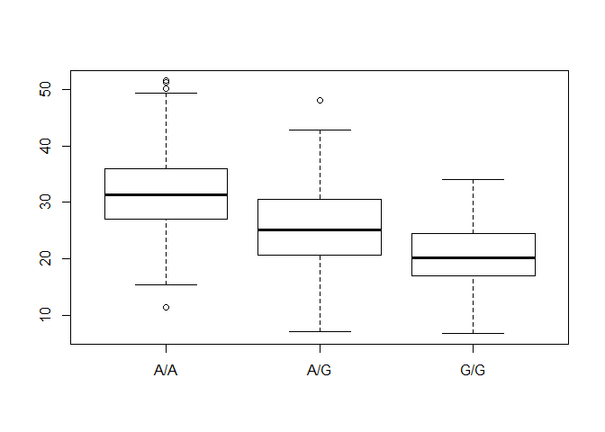

Class 14
================
Diego Quintero

Import Asthma data from csv

``` r
asthmaData <- read.csv("373531-SampleGenotypes-Homo_sapiens_Variation_Sample_rs8067378.csv")
```

``` r
TotalGenotypes <- nrow(asthmaData)

num_AA <- asthmaData$Genotype..forward.strand. == 'A|A'

num_AA = sum(num_AA)
```

``` r
prop_AA <- num_AA/TotalGenotypes*100

prop_AA <- round(prop_AA,2)
```

There are 34.38% "A|A" genotypes out of 64

Section 2
---------

``` r
library(seqinr)
```

    ## Warning: package 'seqinr' was built under R version 3.5.1

``` r
library(gtools)
phred <- asc( s2c("DDDDCDEDCDDDDBBDDDCC@") ) - 33
phred 
```

    ##  D  D  D  D  C  D  E  D  C  D  D  D  D  B  B  D  D  D  C  C  @ 
    ## 35 35 35 35 34 35 36 35 34 35 35 35 35 33 33 35 35 35 34 34 31

``` r
newFile <- read.table("rs8067378_ENSG00000172057.6.txt")

justAA <- newFile$geno == "A/A"
justAG <- newFile$geno == "A/G"
justGG <- newFile$geno == "G/G"


sumAA <- summary(newFile$exp[justAA])
sumAG <- summary(newFile$exp[justAG])
sumGG <- summary(newFile$exp[justGG])

boxplot(exp ~ geno,data = newFile)
```


